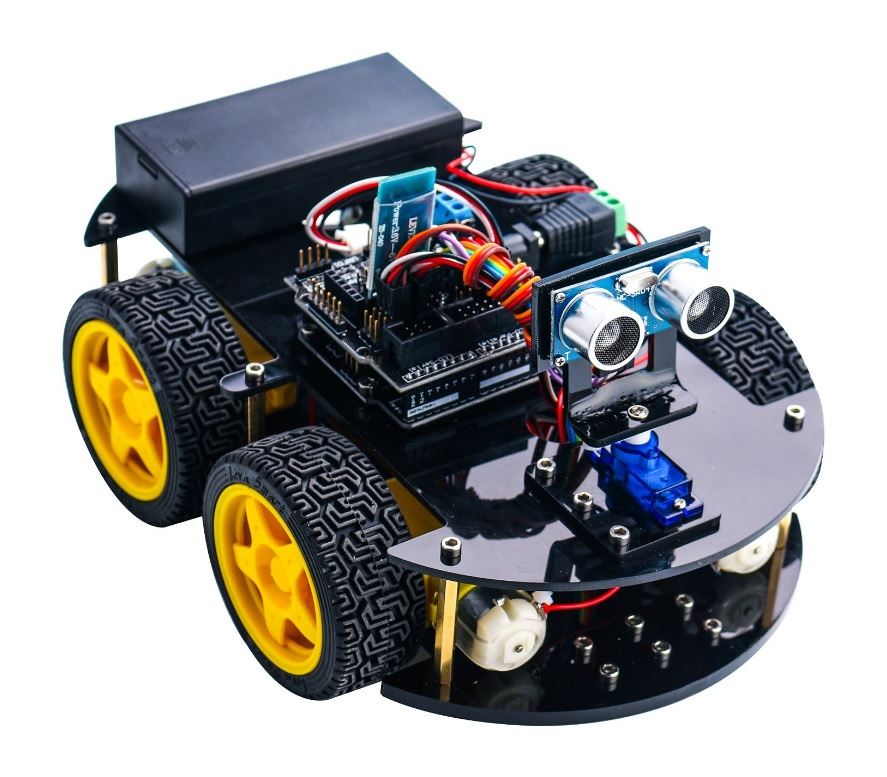

# Password-Wizard
As a robotics instructor I teach students in my free time. This repo is one such project. 

This project uses Arduino UNO or Arduino MEGA to run the code

Using an IR remote, a user can setup secure access with upto 6 digit password. 
Once the password is successfully enterered, a menu pops up with a list of options to choose from such as 

- Line Following
- Servos 
- LED's 
- Object following
- Ultrasonic object detection. 

The project runs on a robotics car purchased from Eelego linked below

https://www.amazon.ca/ELEGOO-Ultrasonic-Bluetooth-Intelligent-Educational/dp/B07485YQP8/ref=sr_1_2?keywords=elegoo+arduino+car&qid=1579482806&sr=8-2

